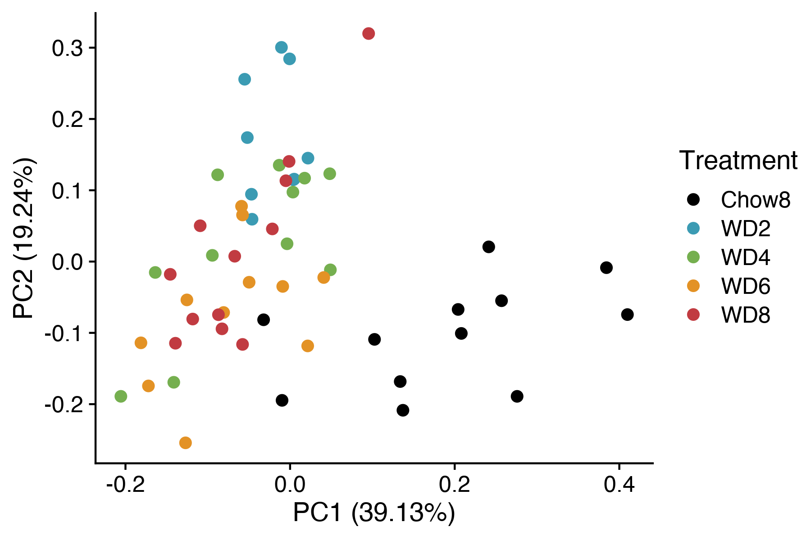
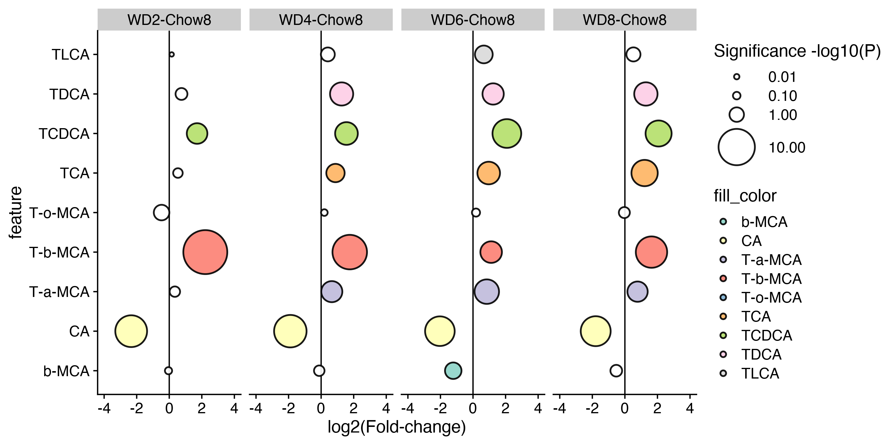

Analysis of bile acids data
================
Timothy Yu

This notebook analyzes the bile acids dataset.

``` r
sessionInfo()
```

    ## R version 4.0.2 (2020-06-22)
    ## Platform: x86_64-apple-darwin17.0 (64-bit)
    ## Running under: macOS Catalina 10.15.7
    ## 
    ## Matrix products: default
    ## BLAS:   /System/Library/Frameworks/Accelerate.framework/Versions/A/Frameworks/vecLib.framework/Versions/A/libBLAS.dylib
    ## LAPACK: /Library/Frameworks/R.framework/Versions/4.0/Resources/lib/libRlapack.dylib
    ## 
    ## locale:
    ## [1] en_US.UTF-8/en_US.UTF-8/en_US.UTF-8/C/en_US.UTF-8/en_US.UTF-8
    ## 
    ## attached base packages:
    ## [1] stats     graphics  grDevices utils     datasets  methods   base     
    ## 
    ## other attached packages:
    ##  [1] rmarkdown_2.11     cowplot_1.1.1      RColorBrewer_1.1-3 DescTools_0.99.44 
    ##  [5] viridis_0.6.2      viridisLite_0.4.0  bnstruct_1.0.11    igraph_1.2.9      
    ##  [9] bitops_1.0-7       ggfortify_0.4.13   forcats_0.5.1      stringr_1.4.0     
    ## [13] dplyr_1.0.9        purrr_0.3.4        readr_2.1.1        tidyr_1.2.0       
    ## [17] tibble_3.1.8       ggplot2_3.3.6      tidyverse_1.3.1   
    ## 
    ## loaded via a namespace (and not attached):
    ##  [1] fs_1.5.2          lubridate_1.8.0   httr_1.4.2        tools_4.0.2      
    ##  [5] backports_1.4.0   utf8_1.2.2        R6_2.5.1          DBI_1.1.1        
    ##  [9] colorspace_2.0-3  withr_2.5.0       tidyselect_1.1.2  gridExtra_2.3    
    ## [13] Exact_3.1         compiler_4.0.2    textshaping_0.3.6 cli_3.3.0        
    ## [17] rvest_1.0.2       expm_0.999-6      xml2_1.3.3        labeling_0.4.2   
    ## [21] scales_1.2.0      mvtnorm_1.1-3     proxy_0.4-26      systemfonts_1.0.4
    ## [25] digest_0.6.29     pkgconfig_2.0.3   htmltools_0.5.2   dbplyr_2.1.1     
    ## [29] fastmap_1.1.0     highr_0.9         rlang_1.0.4       readxl_1.3.1     
    ## [33] rstudioapi_0.13   generics_0.1.3    farver_2.1.1      jsonlite_1.7.2   
    ## [37] magrittr_2.0.3    Matrix_1.3-4      Rcpp_1.0.7        munsell_0.5.0    
    ## [41] fansi_1.0.3       lifecycle_1.0.1   stringi_1.7.6     yaml_2.2.1       
    ## [45] MASS_7.3-54       rootSolve_1.8.2.3 plyr_1.8.6        grid_4.0.2       
    ## [49] crayon_1.4.2      lmom_2.8          lattice_0.20-45   haven_2.4.3      
    ## [53] hms_1.1.1         knitr_1.36        pillar_1.8.0      boot_1.3-28      
    ## [57] gld_2.6.3         reshape2_1.4.4    reprex_2.0.1      glue_1.6.2       
    ## [61] evaluate_0.14     data.table_1.14.2 modelr_0.1.8      vctrs_0.4.1      
    ## [65] tzdb_0.2.0        cellranger_1.1.0  gtable_0.3.0      assertthat_0.2.1 
    ## [69] xfun_0.28         broom_0.7.10      e1071_1.7-9       ragg_1.2.2       
    ## [73] class_7.3-19      ellipsis_0.3.2

``` r
knitr::opts_chunk$set(echo = TRUE)
knitr::opts_chunk$set(dev.args = list(png = list(type = "cairo")))
```

Read in bile acids dataset.

``` r
BA_totalpool = read.csv('../processed_data/datasets/BA_totalpool.csv', header = TRUE, stringsAsFactors = FALSE, check.names = FALSE)
```

PCA plot of bile acids data.

``` r
autoplot(prcomp(BA_totalpool[-c(1,2)], scale. = TRUE), data = BA_totalpool, colour = 'Treatment', size = 2.5) + scale_color_manual(values = c('black', '#3b9bb3', '#75af4f', '#e39225', '#c13b41'))
```



``` r
#ggsave('../figures/bile_acids_totalpool_pca.pdf', height = 3.5, width = 5)
```

Bubble plot showing relative fold-change in bile acids.

``` r
BA_totalpool_sub = BA_totalpool %>% dplyr::select(
  ID, Treatment,
  `T-a-MCA`, `T-b-MCA`, `T-o-MCA`, `TCDCA`, `TCA`, `TDCA`, `TLCA`, `b-MCA`, `CA`
)

bubdata = makeBubbleData(BA_totalpool_sub)
bubp = getBubbleSignificance(bubdata)
makeBubblePlot(bubp, abundance=FALSE)
```



``` r
#ggsave('../figures/bile_acids_bubble_plot.pdf', height = 4, width = 13)
#write.csv(bubp, '../../ba_bubble_significance.csv')
```

``` r
options(scipen=999)
percent_BA = BA_totalpool %>% 
  gather("bile_acid", "abundance", -c(ID, Treatment)) %>%
  group_by(Treatment, bile_acid) %>%
  mutate(median_abundance = median(abundance)) %>%
  select(Treatment, bile_acid, median_abundance) %>%
  ungroup() %>%
  distinct() %>%
  group_by(Treatment) %>%
  mutate(total_abundance = sum(median_abundance)) %>%
  mutate(percent_bile_acid = (median_abundance / total_abundance) * 100)
```

``` r
# rmarkdown::render("bile_acids.Rmd")
# mv bile_acids.md ../markdowns/
# mv bile_acids_files ../markdowns/
```
