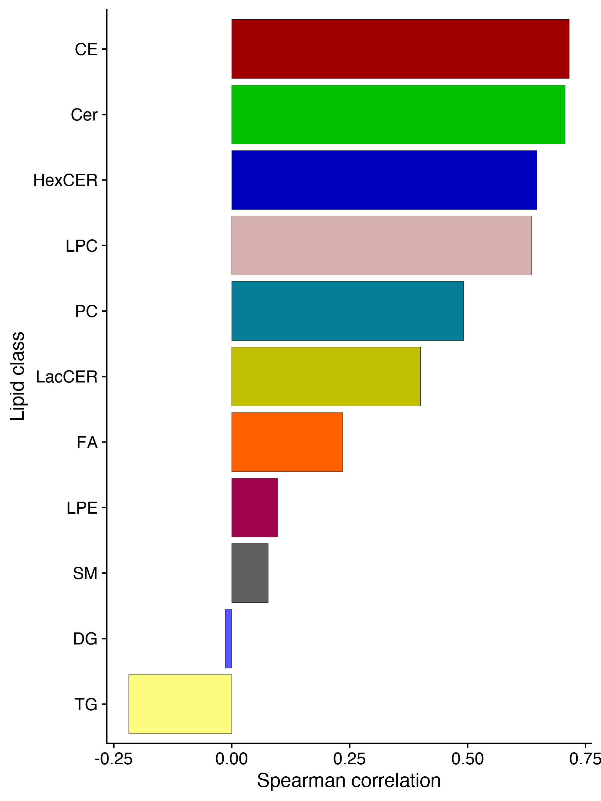

Analysis of lipidomics data
================
Timothy Yu

This notebook analyzes the liver and plasma lipidomics datasets.

``` r
sessionInfo()
```

    ## R version 4.0.2 (2020-06-22)
    ## Platform: x86_64-apple-darwin17.0 (64-bit)
    ## Running under: macOS Catalina 10.15.7
    ## 
    ## Matrix products: default
    ## BLAS:   /System/Library/Frameworks/Accelerate.framework/Versions/A/Frameworks/vecLib.framework/Versions/A/libBLAS.dylib
    ## LAPACK: /Library/Frameworks/R.framework/Versions/4.0/Resources/lib/libRlapack.dylib
    ## 
    ## locale:
    ## [1] en_US.UTF-8/en_US.UTF-8/en_US.UTF-8/C/en_US.UTF-8/en_US.UTF-8
    ## 
    ## attached base packages:
    ## [1] stats     graphics  grDevices utils     datasets  methods   base     
    ## 
    ## other attached packages:
    ##  [1] cowplot_1.1.1      RColorBrewer_1.1-3 DescTools_0.99.44  viridis_0.6.2     
    ##  [5] viridisLite_0.4.0  bnstruct_1.0.11    igraph_1.2.9       bitops_1.0-7      
    ##  [9] ggfortify_0.4.13   forcats_0.5.1      stringr_1.4.0      dplyr_1.0.9       
    ## [13] purrr_0.3.4        readr_2.1.1        tidyr_1.2.0        tibble_3.1.8      
    ## [17] ggplot2_3.3.6      tidyverse_1.3.1   
    ## 
    ## loaded via a namespace (and not attached):
    ##  [1] httr_1.4.2        jsonlite_1.7.2    modelr_0.1.8      assertthat_0.2.1 
    ##  [5] expm_0.999-6      gld_2.6.3         lmom_2.8          cellranger_1.1.0 
    ##  [9] yaml_2.2.1        pillar_1.8.0      backports_1.4.0   lattice_0.20-45  
    ## [13] glue_1.6.2        digest_0.6.29     rvest_1.0.2       colorspace_2.0-3 
    ## [17] htmltools_0.5.2   Matrix_1.3-4      pkgconfig_2.0.3   broom_0.7.10     
    ## [21] haven_2.4.3       mvtnorm_1.1-3     scales_1.2.0      rootSolve_1.8.2.3
    ## [25] tzdb_0.2.0        proxy_0.4-26      farver_2.1.1      generics_0.1.3   
    ## [29] ellipsis_0.3.2    withr_2.5.0       cli_3.3.0         magrittr_2.0.3   
    ## [33] crayon_1.4.2      readxl_1.3.1      evaluate_0.14     fs_1.5.2         
    ## [37] fansi_1.0.3       MASS_7.3-54       xml2_1.3.3        class_7.3-19     
    ## [41] tools_4.0.2       data.table_1.14.2 hms_1.1.1         lifecycle_1.0.1  
    ## [45] Exact_3.1         munsell_0.5.0     reprex_2.0.1      compiler_4.0.2   
    ## [49] e1071_1.7-9       rlang_1.0.4       grid_4.0.2        rstudioapi_0.13  
    ## [53] labeling_0.4.2    rmarkdown_2.11    boot_1.3-28       gtable_0.3.0     
    ## [57] DBI_1.1.1         R6_2.5.1          gridExtra_2.3     lubridate_1.8.0  
    ## [61] knitr_1.36        fastmap_1.1.0     utf8_1.2.2        stringi_1.7.6    
    ## [65] Rcpp_1.0.7        vctrs_0.4.1       dbplyr_2.1.1      tidyselect_1.1.2 
    ## [69] xfun_0.28

``` r
knitr::opts_chunk$set(echo = TRUE)
knitr::opts_chunk$set(dev.args = list(png = list(type = "cairo")))
```

Read in liver lipidomics dataset.

``` r
liverData = read.csv('../processed_data/datasets/Lipidomics_liver_normliverweight.csv', header = TRUE, stringsAsFactors = FALSE, check.names = FALSE)
```

By 90% confidence ellipse, Mice 53 and 39 are outliers. We will remove
them and re-plot the PCA. They are excluded from the remaining analysis.

``` r
autoplot(prcomp((liverData[-c(1,2)] %>% select_if(~ !any(is.na(.)))), scale. = TRUE), 
         data = liverData, colour = 'Treatment', 
         size = 0.1, label = TRUE, label.size = 3, frame = TRUE, frame.type = 'norm', 
         frame.level = 0.90) + 
         scale_color_manual(values = c('black', '#3b9bb3', '#75af4f', '#e39225', '#c13b41')) +
         scale_fill_manual(values = c('black', '#3b9bb3', '#75af4f', '#e39225', '#c13b41'))
```


PCA plot of liver lipidomics data.

``` r
liverData = liverData %>% filter(!ID %in% c(39,53))
autoplot(prcomp((liverData[-c(1,2)] %>% select_if(~ !any(is.na(.)))), scale. = TRUE), 
         data = liverData, colour = 'Treatment', size = 2.5) + 
  scale_color_manual(values = c('black', '#3b9bb3', '#75af4f', '#e39225', '#c13b41'))
```


``` r
#ggsave('../figures/lipidomics_liver_pca.pdf', height = 3.5, width = 5)
```

Bubble plot showing relative fold-change in liver lipid abundance.

``` r
colors <- c("#A00000", "#00C000", "#5757F9", "#FF6000", "#0000C0", "#C0C000", "#D7B0B0",
            "#9F044D", "#077E97", "#C5944E", "#034E61", "#FFA040", "#606060", "#fcfc81")

bubdata = makeBubbleData(liverData)
bubp = getBubbleSignificance(bubdata)
makeBubblePlot(bubp, abundance=FALSE, colors=colors, bubble_range=c(3,10))
```


``` r
#ggsave('../figures/lipidomics_liver_bubble_plot.pdf', height = 5.5, width = 15)
#write.csv(bubp, '../processed_data/misc/lipidomics_liver_bubble_stats.csv')
```

Abundance of individual hepatic TG species split by SFA, MUFA, and PUFA.

``` r
scaled_liverData = cbind(liverData[,c(1,2)], scale(liverData[,-c(1,2)])) # mean 0, sd 1

mean_TG_data = scaled_liverData %>%
  select_if(~ !any(is.na(.))) %>%
  gather(Feature, Value, 3:ncol(.)) %>%
  separate(col = 'Feature', into = c("Class", "Chain"), sep = "\\.", 
          remove = FALSE, extra = 'drop') %>%
  filter(Class == 'TG') %>%
  group_by(Treatment, Feature, Chain) %>%
  mutate(Mean_abundance = mean(Value)) %>%
  select(Treatment, Feature, Chain, Mean_abundance) %>%
  distinct() %>%
  mutate(Saturation = case_when(
    str_extract(Feature, "TG\\.\\d+\\.\\d+") %>% 
      str_extract("\\.\\d+$") %>%
      str_replace("\\.", "") %>%
      as.numeric() == 0 ~ "SFA",
    str_extract(Feature, "TG\\.\\d+\\.\\d+") %>% 
      str_extract("\\.\\d+$") %>%
      str_replace("\\.", "") %>%
      as.numeric() == 1 ~ "MUFA",
    str_extract(Feature, "TG\\.\\d+\\.\\d+") %>% 
      str_extract("\\.\\d+$") %>%
      str_replace("\\.", "") %>%
      as.numeric() > 1 ~ "PUFA",
    TRUE ~ NA_character_
  )) %>% mutate(Treatment = as.factor(Treatment)) %>% mutate(
    Treatment = fct_recode(
      Treatment,
      "0" = "Chow8",
      "2" = "WD2",
      "4" = "WD4",
      "6" = "WD6",
      "8" = "WD8"
  )
)

mean_TG_data %>% 
  ggplot(aes(x = Treatment, y = Mean_abundance, color = Saturation, group = Feature)) +
  geom_line(size=0.5, alpha=0.7) +
  scale_color_manual(values = c("SFA" = "#3969AC", "MUFA" = "#F2B701", "PUFA" = "#E73F74")) +
  labs(x = "Weeks on Western Diet",
       y = "Mean abundance (z-score)",
       color = "Saturation") +
  theme(legend.position = "right") +
  facet_wrap(~Saturation, scales = 'free')
```


``` r
#ggsave('../figures/lipidomics_liver_TG_saturation_change.pdf', height = 3, width = 9)
```

Read in plasma lipidomics dataset.

``` r
plasmaData = read.csv('../processed_data/datasets/Lipidomics_plasma.csv', header = TRUE, stringsAsFactors = FALSE, check.names = FALSE)
```

Plot PCA. There are no outliers.

``` r
autoplot(prcomp((plasmaData[-c(1,2)] %>% select_if(~ !any(is.na(.)))), scale. = TRUE), 
         data = plasmaData, colour = 'Treatment', 
         size = 0.1, label = TRUE, label.size = 3, frame = TRUE, frame.type = 'norm', 
         frame.level = 0.95) + 
         scale_color_manual(values = c('black', '#3b9bb3', '#75af4f', '#e39225', '#c13b41')) +
         scale_fill_manual(values = c('black', '#3b9bb3', '#75af4f', '#e39225', '#c13b41'))
```


PCA plot of plasma lipidomics data

``` r
autoplot(prcomp((plasmaData[-c(1,2)] %>% select_if(~ !any(is.na(.)))), scale. = TRUE), data = plasmaData, colour = 'Treatment', size = 2.5) + scale_color_manual(values = c('black', '#3b9bb3', '#75af4f', '#e39225', '#c13b41'))
```


``` r
#ggsave('../figures/lipidomics_plasma_pca.pdf', height = 3.5, width = 5)
```

Bubble plot showing relative fold-change in plasma lipid abundance.

``` r
colors <- c("#A00000", "#00C000", "#5757F9", "#FF6000", "#0000C0", "#C0C000", "#D7B0B0",
            "#9F044D", "#077E97", "#606060", "#fcfc81")

bubdata = makeBubbleData(plasmaData) %>% filter(!Feat %in% c("PE", "PE_O", "PE_P"))
bubp = getBubbleSignificance(bubdata)
makeBubblePlot(bubp, abundance=FALSE, colors=colors, bubble_range=c(3,10))
```


``` r
#ggsave('../figures/lipidomics_plasma_bubble_plot.pdf', height = 5, width = 15)
#write.csv(bubp, '../processed_data/misc/lipidomics_plasma_bubble_stats.csv')
```

Plot abundance of plasma CE species.

``` r
abundant_CE = plasmaData %>% select(grep("CE", colnames(.))) %>%
  colMeans() %>% as.data.frame() %>%
  filter(. > 50)

scaled_plasmaData = cbind(plasmaData[,c(1,2)], 
                    scale(plasmaData %>% select(rownames(abundant_CE)))) # mean 0, sd 1

CE_data = scaled_plasmaData %>%
  gather(Feature, Value, 3:ncol(.))

order = c(unique((CE_data %>% filter(Treatment == 'Chow8'))$ID),
          unique((CE_data %>% filter(Treatment == 'WD2'))$ID),
          unique((CE_data %>% filter(Treatment == 'WD4'))$ID),
          unique((CE_data %>% filter(Treatment == 'WD6'))$ID),
          unique((CE_data %>% filter(Treatment == 'WD8'))$ID))

CE_data %>% ggplot(aes(x = Feature, y = as.factor(ID))) + 
  geom_tile(aes(fill = Value), alpha = 1) + 
  scale_fill_distiller(palette='RdYlBu') +
  scale_y_discrete(limits = rev(factor(order))) + 
  theme(axis.text.x = element_text(angle = 90, vjust = 0.5, hjust=1), 
        axis.title.x = element_blank(), axis.title.y = element_blank())
```


``` r
#ggsave('../figures/lipidomics_plasma_CE_heatmap.pdf', height = 14, width = 9)
```

Abundance of individual plasma TG species split by SFA, MUFA, and PUFA.

``` r
scaled_plasmaData = cbind(plasmaData[,c(1,2)], scale(plasmaData[,-c(1,2)])) # mean 0, sd 1

mean_plasma_TG_data = scaled_plasmaData %>%
  select_if(~ !any(is.na(.))) %>%
  gather(Feature, Value, 3:ncol(.)) %>%
  separate(col = 'Feature', into = c("Class", "Chain"), sep = "\\.", 
          remove = FALSE, extra = 'drop') %>%
  filter(Class == 'TG') %>%
  group_by(Treatment, Feature, Chain) %>%
  mutate(Mean_abundance = mean(Value)) %>%
  select(Treatment, Feature, Chain, Mean_abundance) %>%
  distinct() %>%
  mutate(Saturation = case_when(
    str_extract(Feature, "TG\\.\\d+\\.\\d+") %>% 
      str_extract("\\.\\d+$") %>%
      str_replace("\\.", "") %>%
      as.numeric() == 0 ~ "SFA",
    str_extract(Feature, "TG\\.\\d+\\.\\d+") %>% 
      str_extract("\\.\\d+$") %>%
      str_replace("\\.", "") %>%
      as.numeric() == 1 ~ "MUFA",
    str_extract(Feature, "TG\\.\\d+\\.\\d+") %>% 
      str_extract("\\.\\d+$") %>%
      str_replace("\\.", "") %>%
      as.numeric() > 1 ~ "PUFA",
    TRUE ~ NA_character_
  )) %>% mutate(Treatment = as.factor(Treatment)) %>% mutate(
    Treatment = fct_recode(
      Treatment,
      "0" = "Chow8",
      "2" = "WD2",
      "4" = "WD4",
      "6" = "WD6",
      "8" = "WD8"
  )
)

mean_plasma_TG_data %>% 
  ggplot(aes(x = Treatment, y = Mean_abundance, color = Saturation, group = Feature)) +
  geom_line(size=0.5, alpha=0.7) +
  scale_color_manual(values = c("SFA" = "#3969AC", "MUFA" = "#F2B701", "PUFA" = "#E73F74")) +
  labs(x = "Weeks on Western Diet",
       y = "Mean abundance (z-score)",
       color = "Saturation",
       title = "Plasma TG") +
  theme(legend.position = "right") +
  facet_wrap(~Saturation, scales = 'free')
```


``` r
#ggsave('../figures/lipidomics_plasma_TG_saturation_change.pdf', height = 3, width = 9)
```

Spearman correlation between hepatic and plasma lipids.

``` r
# correlate total lipid classes between liver and plasma
totalLipidbyClass_liver = liverData %>%
  gather(Feature, Value, 3:ncol(.)) %>%
  separate(col = 'Feature', into = c("Class"), sep = "\\.", remove = FALSE, extra = 'drop') %>%
  mutate(RefinedClass = ifelse(grepl("PE[.]O", Feature), "PE_O",
                        ifelse(grepl("PE[.]P", Feature), "PE_P", Class))) %>%
  select(-Class) %>%
  group_by(ID, RefinedClass) %>%
  drop_na() %>%
  mutate(totalLipid = sum(Value)) %>%
  ungroup() %>%
  select(ID, Treatment, RefinedClass, totalLipid) %>%
  distinct() %>%
  group_by(RefinedClass) %>%
  mutate(n_groups = length(unique(Treatment))) %>%
  filter(n_groups == 5) %>%
  ungroup() %>%
  select(-n_groups)

totalLipidbyClass_plasma = plasmaData %>%
  gather(Feature, Value, 3:ncol(.)) %>%
  separate(col = 'Feature', into = c("Class"), sep = "\\.", remove = FALSE, extra = 'drop') %>%
  mutate(RefinedClass = ifelse(grepl("PE[.]O", Feature), "PE_O",
                        ifelse(grepl("PE[.]P", Feature), "PE_P", Class))) %>%
  select(-Class) %>%
  group_by(ID, RefinedClass) %>%
  drop_na() %>%
  mutate(totalLipid = sum(Value)) %>%
  ungroup() %>%
  select(ID, Treatment, RefinedClass, totalLipid) %>%
  distinct() %>%
  group_by(RefinedClass) %>%
  mutate(n_groups = length(unique(Treatment))) %>%
  filter(n_groups == 5) %>%
  ungroup() %>%
  select(-n_groups)
 
lipids_in_common = intersect(totalLipidbyClass_liver$RefinedClass, totalLipidbyClass_plasma$RefinedClass)
 
df = data.frame("LipidClass" = character(), "Spearman_corr" = numeric(), "p_val" = numeric())
for (lipid1 in lipids_in_common) {
  lipid_in_liver = totalLipidbyClass_liver %>% filter(RefinedClass == lipid1)
  for (lipid2 in lipids_in_common) {
    lipid_in_plasma = totalLipidbyClass_plasma %>% filter(RefinedClass == lipid2)
    combined = left_join(lipid_in_liver, lipid_in_plasma, by = 'ID')
    corr = cor.test(combined$totalLipid.x, 
                    combined$totalLipid.y, 
                    method=c("pearson", "kendall", "spearman"))$estimate
    p = cor.test(combined$totalLipid.x, 
                 combined$totalLipid.y, 
                 method=c("pearson", "kendall", "spearman"))$p.value
    df = rbind(df, data.frame("Lipid_liver" = lipid1,
                              "Lipid_plasma" = lipid2,
                              "Spearman_corr" = corr,
                              "p_val" = p))
  }
}

df = df %>% filter(Lipid_liver == Lipid_plasma)
print(df)
```

    ##        Lipid_liver Lipid_plasma Spearman_corr        p_val
    ## cor             CE           CE    0.71549437 2.766110e-10
    ## cor12          Cer          Cer    0.70683515 5.621805e-10
    ## cor24           DG           DG   -0.01350867 9.198331e-01
    ## cor36           FA           FA    0.23510071 7.565230e-02
    ## cor48       HexCER       HexCER    0.64685887 4.113040e-08
    ## cor60          LPC          LPC    0.63532860 8.445839e-08
    ## cor72          LPE          LPE    0.09799739 4.642641e-01
    ## cor84       LacCER       LacCER    0.40028149 7.217077e-02
    ## cor96           PC           PC    0.49167729 8.872032e-05
    ## cor108          SM           SM    0.07739667 5.636210e-01
    ## cor120          TG           TG   -0.21837782 9.958776e-02

``` r
# save dataframe
write.csv(df, '../processed_data/misc/liver_plasma_lipid_class_pairwise_corr.csv', row.names=FALSE)

df %>%
  ggplot(aes(x=Spearman_corr, y=reorder(Lipid_liver, Spearman_corr))) +
  geom_bar(aes(fill=Lipid_liver), stat="identity", alpha=1, color='black', size=0.1) +
  scale_fill_manual(values=colors) +
  labs(x='Spearman correlation', y='Lipid class') +
  theme(legend.position = 'none')
```



``` r
#ggsave('../figures/lipidomics_plasma_liver_corr_barplot.pdf', height = 7.5, width = 5.5)
```

``` r
# rmarkdown::render("lipidomics.Rmd")
# mv lipidomics.md ../markdowns/
# mv lipidomics_files ../markdowns/
```
