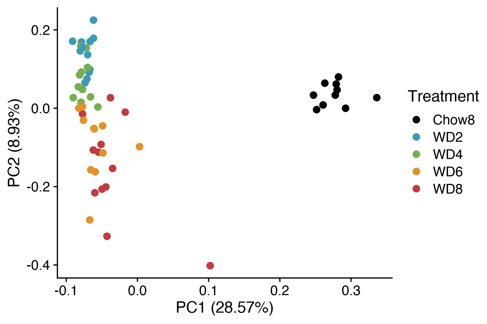
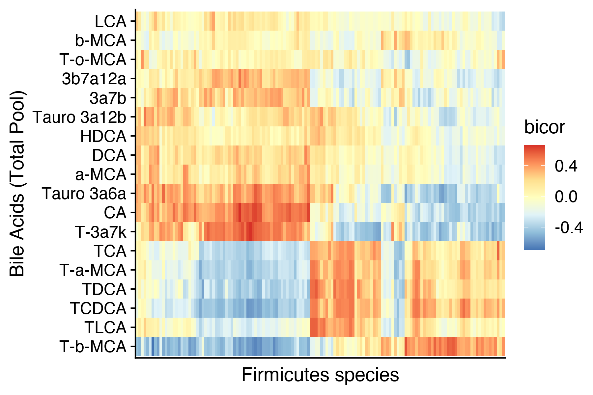
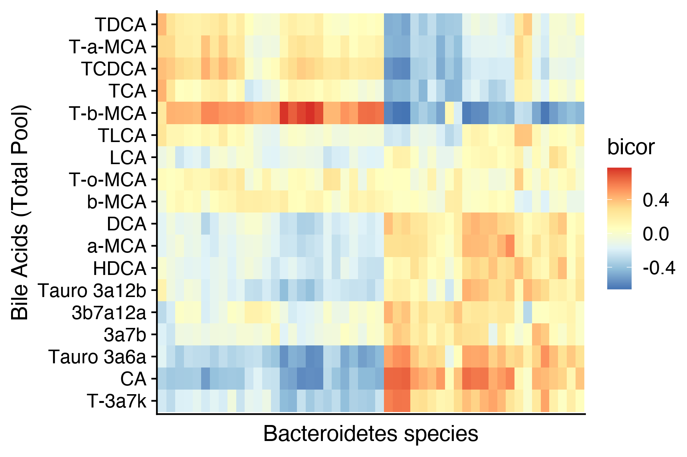
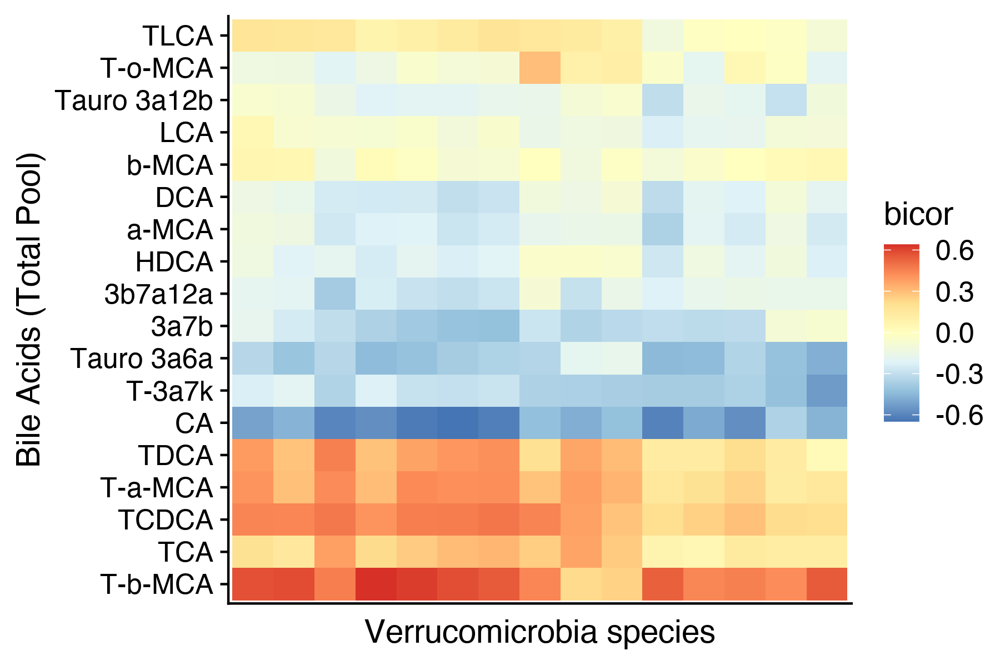
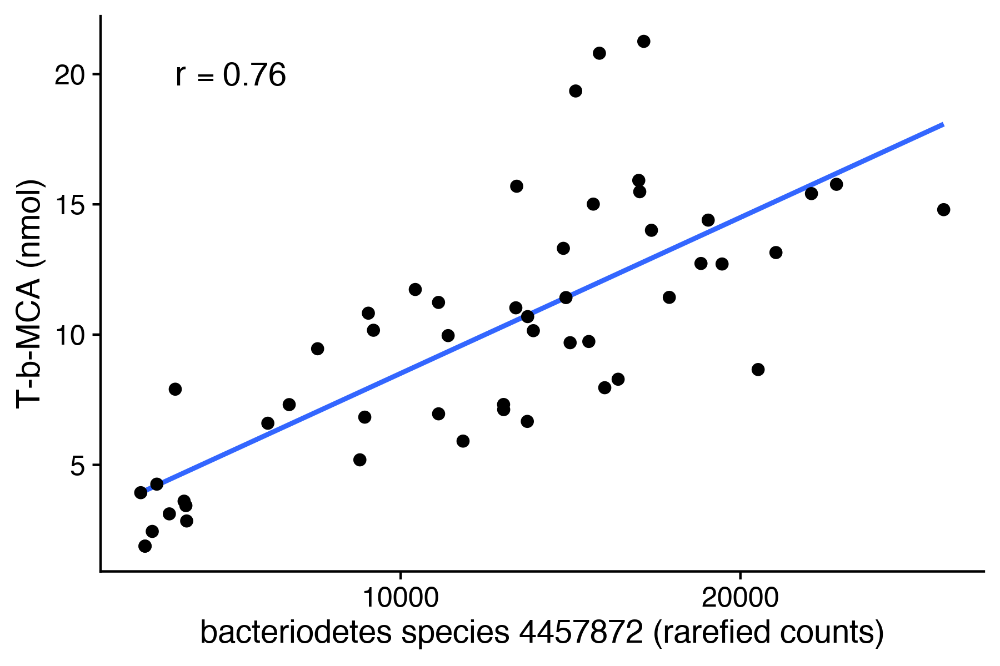
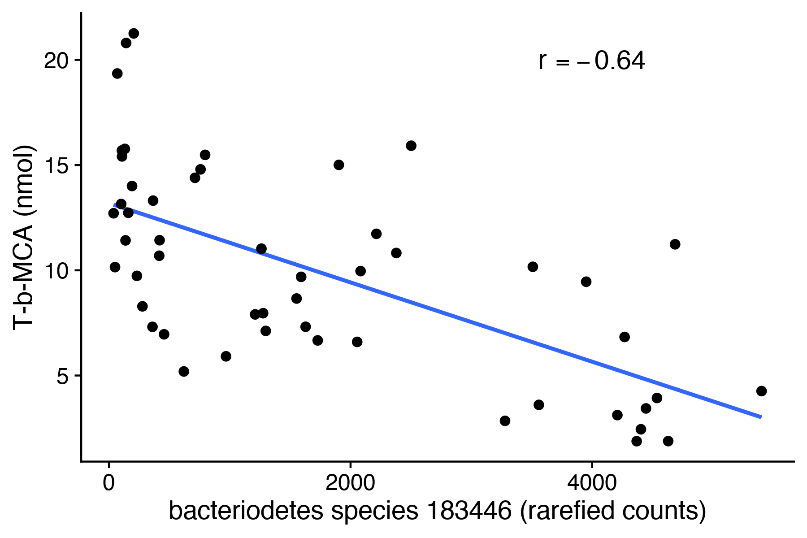
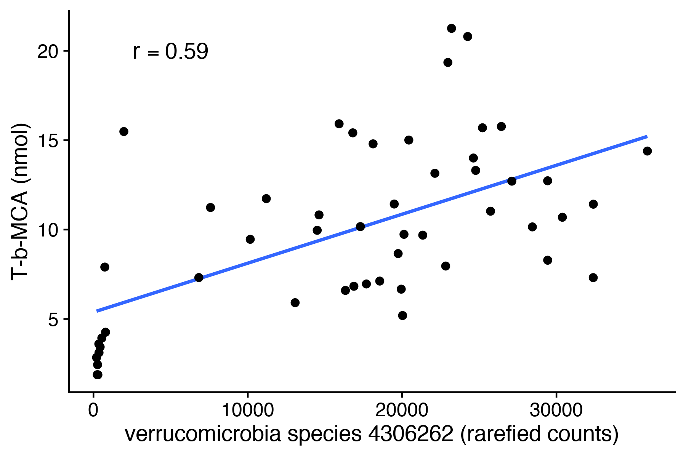

Analysis of microbiome data
================
Timothy Yu

This notebook analyzes the microbiome dataset.

``` r
sessionInfo()
```

    ## R version 4.0.2 (2020-06-22)
    ## Platform: x86_64-apple-darwin17.0 (64-bit)
    ## Running under: macOS Catalina 10.15.7
    ## 
    ## Matrix products: default
    ## BLAS:   /System/Library/Frameworks/Accelerate.framework/Versions/A/Frameworks/vecLib.framework/Versions/A/libBLAS.dylib
    ## LAPACK: /Library/Frameworks/R.framework/Versions/4.0/Resources/lib/libRlapack.dylib
    ## 
    ## locale:
    ## [1] en_US.UTF-8/en_US.UTF-8/en_US.UTF-8/C/en_US.UTF-8/en_US.UTF-8
    ## 
    ## attached base packages:
    ## [1] stats     graphics  grDevices utils     datasets  methods   base     
    ## 
    ## other attached packages:
    ##  [1] WGCNA_1.70-3          fastcluster_1.2.3     dynamicTreeCut_1.63-1 rmarkdown_2.11       
    ##  [5] cowplot_1.1.1         RColorBrewer_1.1-3    DescTools_0.99.44     viridis_0.6.2        
    ##  [9] viridisLite_0.4.0     bnstruct_1.0.11       igraph_1.2.9          bitops_1.0-7         
    ## [13] ggfortify_0.4.13      forcats_0.5.1         stringr_1.4.0         dplyr_1.0.9          
    ## [17] purrr_0.3.4           readr_2.1.1           tidyr_1.2.0           tibble_3.1.8         
    ## [21] ggplot2_3.3.6         tidyverse_1.3.1      
    ## 
    ## loaded via a namespace (and not attached):
    ##   [1] colorspace_2.0-3      ellipsis_0.3.2        class_7.3-19          htmlTable_2.3.0      
    ##   [5] base64enc_0.1-3       fs_1.5.2              gld_2.6.3             rstudioapi_0.13      
    ##   [9] proxy_0.4-26          farver_2.1.1          bit64_4.0.5           AnnotationDbi_1.50.3 
    ##  [13] fansi_1.0.3           mvtnorm_1.1-3         lubridate_1.8.0       xml2_1.3.3           
    ##  [17] splines_4.0.2         codetools_0.2-18      doParallel_1.0.16     impute_1.62.0        
    ##  [21] cachem_1.0.6          rootSolve_1.8.2.3     knitr_1.36            Formula_1.2-4        
    ##  [25] jsonlite_1.7.2        broom_0.7.10          cluster_2.1.2         GO.db_3.11.4         
    ##  [29] dbplyr_2.1.1          png_0.1-7             compiler_4.0.2        httr_1.4.2           
    ##  [33] backports_1.4.0       assertthat_0.2.1      Matrix_1.3-4          fastmap_1.1.0        
    ##  [37] cli_3.3.0             htmltools_0.5.2       tools_4.0.2           gtable_0.3.0         
    ##  [41] glue_1.6.2            lmom_2.8              reshape2_1.4.4        Rcpp_1.0.7           
    ##  [45] Biobase_2.48.0        cellranger_1.1.0      vctrs_0.4.1           nlme_3.1-153         
    ##  [49] preprocessCore_1.50.0 iterators_1.0.13      xfun_0.28             rvest_1.0.2          
    ##  [53] lifecycle_1.0.1       MASS_7.3-54           scales_1.2.0          ragg_1.2.2           
    ##  [57] hms_1.1.1             parallel_4.0.2        expm_0.999-6          yaml_2.2.1           
    ##  [61] Exact_3.1             memoise_2.0.1         gridExtra_2.3         rpart_4.1-15         
    ##  [65] latticeExtra_0.6-29   stringi_1.7.6         RSQLite_2.2.8         highr_0.9            
    ##  [69] S4Vectors_0.26.1      foreach_1.5.1         checkmate_2.0.0       e1071_1.7-9          
    ##  [73] BiocGenerics_0.34.0   boot_1.3-28           matrixStats_0.61.0    rlang_1.0.4          
    ##  [77] pkgconfig_2.0.3       systemfonts_1.0.4     evaluate_0.14         lattice_0.20-45      
    ##  [81] htmlwidgets_1.5.4     labeling_0.4.2        bit_4.0.4             tidyselect_1.1.2     
    ##  [85] plyr_1.8.6            magrittr_2.0.3        R6_2.5.1              Hmisc_4.6-0          
    ##  [89] IRanges_2.22.2        generics_0.1.3        DBI_1.1.1             mgcv_1.8-38          
    ##  [93] foreign_0.8-81        pillar_1.8.0          haven_2.4.3           withr_2.5.0          
    ##  [97] nnet_7.3-16           survival_3.3-1        modelr_0.1.8          crayon_1.4.2         
    ## [101] utf8_1.2.2            tzdb_0.2.0            jpeg_0.1-9            grid_4.0.2           
    ## [105] readxl_1.3.1          data.table_1.14.2     blob_1.2.2            reprex_2.0.1         
    ## [109] digest_0.6.29         textshaping_0.3.6     stats4_4.0.2          munsell_0.5.0

``` r
knitr::opts_chunk$set(echo = TRUE)
knitr::opts_chunk$set(dev.args = list(png = list(type = "cairo")))
```

Read in microbiome dataset.

``` r
data = read.csv('../processed_data/datasets/Microbiome_otu_rarefied.csv', header = TRUE, stringsAsFactors = FALSE, check.names = FALSE)
```

PCA plot of microbiome data.

``` r
autoplot(prcomp(data[-c(1,2)], scale. = TRUE), data = data, colour = 'Treatment', size = 2.5) + scale_color_manual(values = c('black', '#3b9bb3', '#75af4f', '#e39225', '#c13b41'))
```



``` r
#ggsave('../figures/microbiome_rarefied_pca.pdf', height = 3.5, width = 5)
```

``` r
# load in taxonomic information
tax_info = read.csv('../raw_data/Mappings/Microbiome_tax_class_rarefied.csv', header = TRUE, stringsAsFactors = FALSE)

# Rank1     Rank2    Rank3     Rank4     Rank5     Rank6     Rank7
# "Kingdom" "Phylum"  "Class"   "Order"   "Family"  "Genus"   "Species"
```

Read in bile acid dataset for correlations.

``` r
BA_totalpool = read.csv('../processed_data/datasets/BA_totalpool.csv', header = TRUE, stringsAsFactors = FALSE, check.names = FALSE)
```

``` r
createCorrTable <- function(corr_object, data1_name, data2_name) {
  "
  Create correlation / BH-adjusted p-value table from bicor object.
  
  Args ---
  corr_object : bicor object that contains bicor and p 
  data1_name : data type of first argument in bicorAndPValue()
  data2_name : data type of second argument in bicorAndPValue()
  "
  bicor <- corr_object$bicor
  p <- corr_object$p

  x <- bicor %>% as.data.frame() %>%
  tibble::rownames_to_column(var = data1_name) %>%
  gather(!!data2_name, bicor, 2:ncol(.))
    
  y <- p %>% as.data.frame() %>%
  tibble::rownames_to_column(var = data1_name) %>%
  gather(!!data2_name, pval, 2:ncol(.)) %>%
  mutate(adj_pval = p.adjust(pval, method = 'BH', n = length(pval)))

  table <- left_join(x, y, by = c(data1_name, data2_name)) %>%
    dplyr::select(!!data1_name, !!data2_name, bicor, adj_pval)
  return(table)
}
```

``` r
# correlation between firmicutes and total BA species
firmicutes = data %>% 
  dplyr::select(ID, Treatment, (tax_info %>% filter(Rank2 == 'p__Firmicutes'))$OTU)

# only correlate if ID's are in both data sets
common_ids = intersect(firmicutes$ID, BA_totalpool$ID)
firmicutes_mat = firmicutes %>% filter(ID %in% common_ids) %>% arrange(ID)
BA_totalpool_mat = BA_totalpool %>% filter(ID %in% common_ids) %>% arrange(ID)

# check that order of ID's are the same in both data sets
assertthat::are_equal(firmicutes_mat$ID, BA_totalpool_mat$ID)
```

    ## [1] TRUE

``` r
# correlate (NA's and missing values exist, so warnings expected)
corr = bicorAndPvalue((BA_totalpool_mat %>% dplyr::select(-c('ID', 'Treatment'))), 
                      (firmicutes_mat %>% dplyr::select(-c('ID', 'Treatment')))
       )

firmicutes_x_BA_totalpool = createCorrTable(corr, 'totalpool_ba', 'firmicutes')
```

Correlation plot between bile acids and firmicutes species.

``` r
# plot heatmap of significant correlations
sig_firmicutes = (firmicutes_x_BA_totalpool %>% filter(adj_pval < 0.05))$firmicutes %>% unique()

# selected data
selected_df = firmicutes_x_BA_totalpool %>%
  filter(firmicutes %in% sig_firmicutes) %>%
  dplyr::select(-adj_pval) %>%
  spread(firmicutes, bicor, fill=0) %>%
  tibble::column_to_rownames(var="totalpool_ba")

# hierarchical clustering for order
ba_ord = hclust(dist(selected_df, method = "euclidean"), method = "ward.D")$order
firmicutes_ord = hclust(dist(t(selected_df), method = "euclidean"), method = "ward.D")$order

# plot
firmicutes_x_BA_totalpool %>%
  filter(firmicutes %in% sig_firmicutes) %>%
  ggplot(aes(x = firmicutes, y = totalpool_ba)) + geom_tile(aes(fill = bicor)) +
  scale_fill_distiller(palette='RdYlBu') + 
  scale_y_discrete(limits=rownames(selected_df)[ba_ord]) + 
  scale_x_discrete(limits=colnames(selected_df)[firmicutes_ord]) +
  theme(axis.ticks.x = element_blank(),
        axis.text.x = element_blank()) +
  labs(x="Firmicutes species", y="Bile Acids (Total Pool)")
```



``` r
# ggsave('../figures/microbiome_firmicutes_x_ba_totalpool.pdf', height = 4, width = 6)
```

Correlation plot between bile acids and bacteroidetes species.

``` r
# correlation between Bacteroidetes and total BA species
bacteroidetes = data %>% 
  dplyr::select(ID, Treatment, (tax_info %>% filter(Rank2 == 'p__Bacteroidetes'))$OTU)

# only correlate if ID's are in both data sets
common_ids = intersect(bacteroidetes$ID, BA_totalpool$ID)
bacteroidetes_mat = bacteroidetes %>% filter(ID %in% common_ids) %>% arrange(ID)
BA_totalpool_mat = BA_totalpool %>% filter(ID %in% common_ids) %>% arrange(ID)

# check that order of ID's are the same in both data sets
assertthat::are_equal(bacteroidetes_mat$ID, BA_totalpool_mat$ID)
```

    ## [1] TRUE

``` r
# correlate (NA's and missing values exist, so warnings expected)
corr = bicorAndPvalue((BA_totalpool_mat %>% dplyr::select(-c('ID', 'Treatment'))), 
                      (bacteroidetes_mat %>% dplyr::select(-c('ID', 'Treatment')))
       )

bacteroidetes_x_BA_totalpool = createCorrTable(corr, 'totalpool_ba', 'bacteroidetes')
```

Correlation plot between bile acids and bacteroidetes species.

``` r
# plot heatmap of significant correlations
sig_bacteroidetes = (bacteroidetes_x_BA_totalpool %>% filter(adj_pval < 0.05))$bacteroidetes %>% unique()

# selected data
selected_df = bacteroidetes_x_BA_totalpool %>%
  filter(bacteroidetes %in% sig_bacteroidetes) %>%
  dplyr::select(-adj_pval) %>%
  spread(bacteroidetes, bicor, fill=0) %>%
  tibble::column_to_rownames(var="totalpool_ba")

# hierarchical clustering for order
ba_ord = hclust(dist(selected_df, method = "euclidean"), method = "ward.D")$order
bacteroidetes_ord = hclust(dist(t(selected_df), method = "euclidean"), method = "ward.D")$order

# plot
bacteroidetes_x_BA_totalpool %>%
  filter(bacteroidetes %in% sig_bacteroidetes) %>%
  ggplot(aes(x = bacteroidetes, y = totalpool_ba)) + geom_tile(aes(fill = bicor)) +
  scale_fill_distiller(palette='RdYlBu') + 
  scale_y_discrete(limits=rownames(selected_df)[ba_ord]) + 
  scale_x_discrete(limits=colnames(selected_df)[bacteroidetes_ord]) +
  theme(axis.ticks.x = element_blank(),
        axis.text.x = element_blank()) +
  labs(x="Bacteroidetes species", y="Bile Acids (Total Pool)")
```



``` r
# ggsave('../figures/microbiome_bacteroidetes_x_ba_totalpool.pdf', height = 4, width = 6)
```

``` r
# correlation between Verrucomicrobia and total BA species
verruco = data %>% 
  dplyr::select(ID, Treatment, (tax_info %>% filter(Rank2 == 'p__Verrucomicrobia'))$OTU)

# only correlate if ID's are in both data sets
common_ids = intersect(verruco$ID, BA_totalpool$ID)
verruco_mat = verruco %>% filter(ID %in% common_ids) %>% arrange(ID)
BA_totalpool_mat = BA_totalpool %>% filter(ID %in% common_ids) %>% arrange(ID)

# check that order of ID's are the same in both data sets
assertthat::are_equal(verruco_mat$ID, BA_totalpool_mat$ID)
```

    ## [1] TRUE

``` r
# correlate (NA's and missing values exist, so warnings expected)
corr = bicorAndPvalue((BA_totalpool_mat %>% dplyr::select(-c('ID', 'Treatment'))), 
                      (verruco_mat %>% dplyr::select(-c('ID', 'Treatment')))
       )

verruco_x_BA_totalpool = createCorrTable(corr, 'totalpool_ba', 'verruco')
```

Correlation plot between bile acids and verrucomicrobia species.

``` r
# plot heatmap of significant correlations
sig_verruco = (verruco_x_BA_totalpool %>% filter(adj_pval < 0.05))$verruco %>% unique()

# selected data
selected_df = verruco_x_BA_totalpool %>%
  filter(verruco %in% sig_verruco) %>%
  dplyr::select(-adj_pval) %>%
  spread(verruco, bicor, fill=0) %>%
  tibble::column_to_rownames(var="totalpool_ba")

# hierarchical clustering for order
ba_ord = hclust(dist(selected_df, method = "euclidean"), method = "ward.D")$order
verruco_ord = hclust(dist(t(selected_df), method = "euclidean"), method = "ward.D")$order

# plot
verruco_x_BA_totalpool %>%
  filter(verruco %in% sig_verruco) %>%
  ggplot(aes(x = verruco, y = totalpool_ba)) + geom_tile(aes(fill = bicor)) +
  scale_fill_distiller(palette='RdYlBu') + 
  scale_y_discrete(limits=rownames(selected_df)[ba_ord]) + 
  scale_x_discrete(limits=colnames(selected_df)[verruco_ord]) +
  theme(axis.ticks.x = element_blank(),
        axis.text.x = element_blank()) +
  labs(x="Verrucomicrobia species", y="Bile Acids (Total Pool)")
```



``` r
# ggsave('../figures/microbiome_verruco_x_ba_totalpool.pdf', height = 4, width = 6)
```

Positive correlation plot between single bacteriodetes species and
T-b-MCA.

``` r
r = cor(
  bacteroidetes_mat$`4457872`, 
  BA_totalpool_mat$`T-b-MCA`,  
  method = "pearson"
)

ggplot(data=NULL,
  aes(x=bacteroidetes_mat$`4457872`, y=BA_totalpool_mat$`T-b-MCA`)) +
  geom_smooth(method='lm', se=FALSE) +
  geom_point(size=2) + 
  annotate("text", x=5000, y=20, size=5, label="italic(r) == 0.76", parse=TRUE) +
  labs(y='T-b-MCA (nmol)', x='bacteriodetes species 4457872 (rarefied counts)')
```

    ## `geom_smooth()` using formula 'y ~ x'



``` r
# ggsave('../figures/microbiome_bacteroidete_species_x_TbMCA_pos.pdf', height = 4.3, width = 5)
```

Negative correlation plot between single bacteriodetes species and
T-b-MCA.

``` r
r = cor(
  bacteroidetes_mat$`183446`, 
  BA_totalpool_mat$`T-b-MCA`,  
  method = "pearson"
)

ggplot(data=NULL,
  aes(x=bacteroidetes_mat$`183446`, y=BA_totalpool_mat$`T-b-MCA`)) +
  geom_smooth(method='lm', se=FALSE) +
  geom_point(size=2) + 
  annotate("text", x=4000, y=20, size=5, label="italic(r) == -0.64", parse=TRUE) +
  labs(y='T-b-MCA (nmol)', x='bacteriodetes species 183446 (rarefied counts)')
```

    ## `geom_smooth()` using formula 'y ~ x'



``` r
#ggsave('../figures/microbiome_bacteroidete_species_x_TbMCA_neg.pdf', height = 4.3, width = 5)
```

Positive correlation plot between single verrucomicrobia species and
T-b-MCA.

``` r
r = cor(
  verruco_mat$`4306262`, 
  BA_totalpool_mat$`T-b-MCA`,  
  method = "pearson"
)

ggplot(data=NULL,
  aes(x=verruco_mat$`4306262`, y=BA_totalpool_mat$`T-b-MCA`)) +
  geom_smooth(method='lm', se=FALSE) +
  geom_point(size=2) + 
  annotate("text", x=5000, y=20, size=5, label="italic(r) == 0.59", parse=TRUE) +
  labs(y='T-b-MCA (nmol)', x='verrucomicrobia species 4306262 (rarefied counts)')
```

    ## `geom_smooth()` using formula 'y ~ x'



``` r
# ggsave('../figures/microbiome_verruco_species_x_TbMCA_pos_1.pdf', height = 4.3, width = 5)
```

``` r
# rmarkdown::render("microbiome.Rmd")
# mv microbime.md ../markdowns/
# mv microbiome_files ../markdowns/
```
