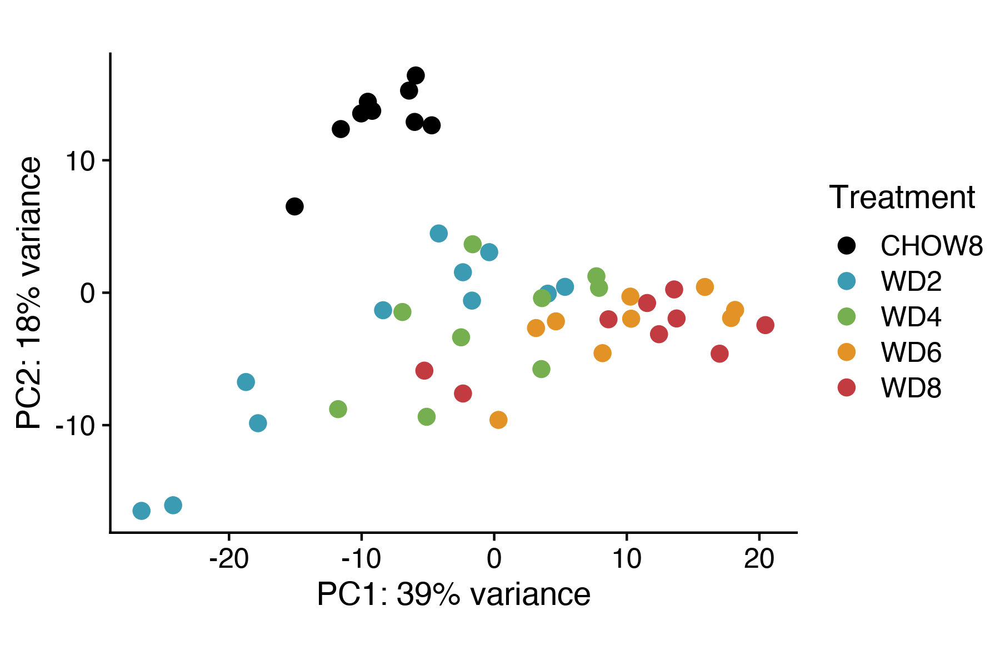
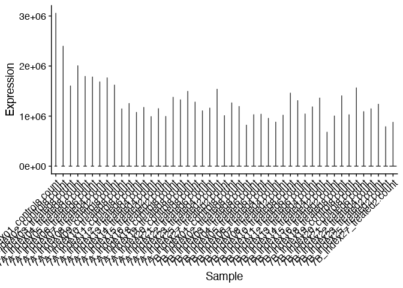
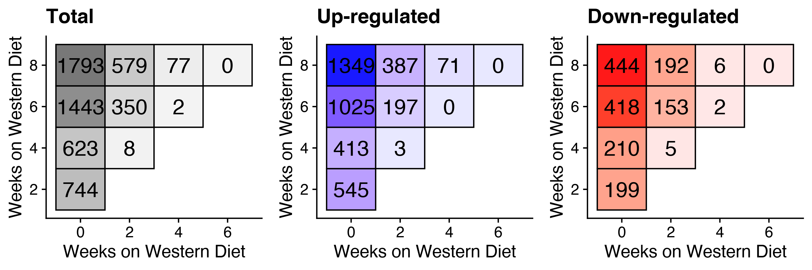
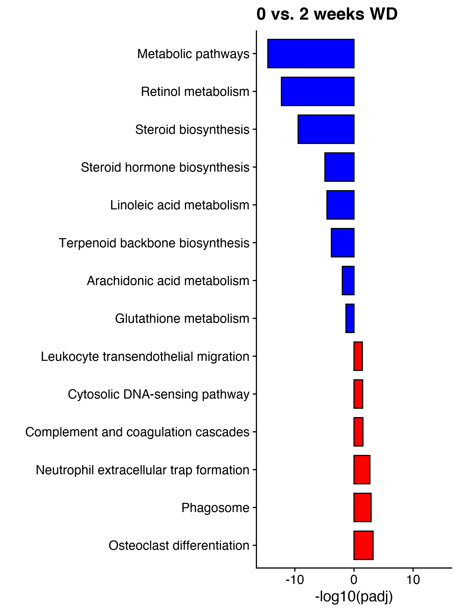
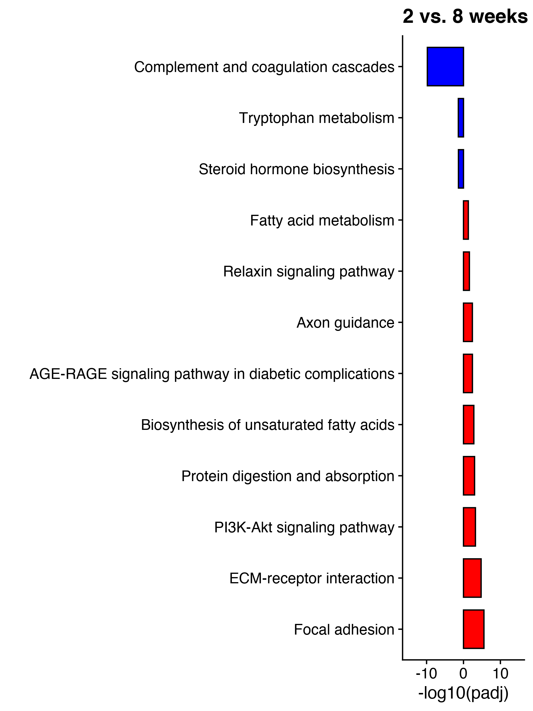

Analysis of RNA-seq data
================
Timothy Yu

This notebook analyzes the RNA-seq dataset.

``` r
sessionInfo()
```

    ## R version 4.0.2 (2020-06-22)
    ## Platform: x86_64-apple-darwin17.0 (64-bit)
    ## Running under: macOS Catalina 10.15.7
    ## 
    ## Matrix products: default
    ## BLAS:   /System/Library/Frameworks/Accelerate.framework/Versions/A/Frameworks/vecLib.framework/Versions/A/libBLAS.dylib
    ## LAPACK: /Library/Frameworks/R.framework/Versions/4.0/Resources/lib/libRlapack.dylib
    ## 
    ## locale:
    ## [1] en_US.UTF-8/en_US.UTF-8/en_US.UTF-8/C/en_US.UTF-8/en_US.UTF-8
    ## 
    ## attached base packages:
    ## [1] parallel  stats4    stats     graphics  grDevices utils     datasets  methods   base     
    ## 
    ## other attached packages:
    ##  [1] EnhancedVolcano_1.6.0       ggrepel_0.9.1               apeglm_1.10.0              
    ##  [4] GenomicFeatures_1.40.1      AnnotationDbi_1.50.3        DESeq2_1.28.1              
    ##  [7] SummarizedExperiment_1.18.2 DelayedArray_0.14.1         matrixStats_0.61.0         
    ## [10] Biobase_2.48.0              GenomicRanges_1.40.0        GenomeInfoDb_1.24.2        
    ## [13] IRanges_2.22.2              S4Vectors_0.26.1            BiocGenerics_0.34.0        
    ## [16] cowplot_1.1.1               RColorBrewer_1.1-3          DescTools_0.99.44          
    ## [19] viridis_0.6.2               viridisLite_0.4.0           bnstruct_1.0.11            
    ## [22] igraph_1.2.9                bitops_1.0-7                ggfortify_0.4.13           
    ## [25] forcats_0.5.1               stringr_1.4.0               dplyr_1.0.9                
    ## [28] purrr_0.3.4                 readr_2.1.1                 tidyr_1.2.0                
    ## [31] tibble_3.1.8                ggplot2_3.3.6               tidyverse_1.3.1            
    ## 
    ## loaded via a namespace (and not attached):
    ##   [1] readxl_1.3.1             backports_1.4.0          BiocFileCache_1.12.1    
    ##   [4] plyr_1.8.6               splines_4.0.2            BiocParallel_1.22.0     
    ##   [7] digest_0.6.29            htmltools_0.5.2          fansi_1.0.3             
    ##  [10] magrittr_2.0.3           memoise_2.0.1            tzdb_0.2.0              
    ##  [13] Biostrings_2.56.0        annotate_1.66.0          modelr_0.1.8            
    ##  [16] bdsmatrix_1.3-4          askpass_1.1              prettyunits_1.1.1       
    ##  [19] colorspace_2.0-3         blob_1.2.2               rvest_1.0.2             
    ##  [22] rappdirs_0.3.3           haven_2.4.3              xfun_0.28               
    ##  [25] crayon_1.4.2             RCurl_1.98-1.5           jsonlite_1.7.2          
    ##  [28] genefilter_1.70.0        Exact_3.1                survival_3.3-1          
    ##  [31] glue_1.6.2               gtable_0.3.0             zlibbioc_1.34.0         
    ##  [34] XVector_0.28.0           scales_1.2.0             mvtnorm_1.1-3           
    ##  [37] DBI_1.1.1                Rcpp_1.0.7               xtable_1.8-4            
    ##  [40] progress_1.2.2           emdbook_1.3.12           bit_4.0.4               
    ##  [43] proxy_0.4-26             httr_1.4.2               ellipsis_0.3.2          
    ##  [46] pkgconfig_2.0.3          XML_3.99-0.8             farver_2.1.1            
    ##  [49] dbplyr_2.1.1             locfit_1.5-9.4           utf8_1.2.2              
    ##  [52] tidyselect_1.1.2         labeling_0.4.2           rlang_1.0.4             
    ##  [55] reshape2_1.4.4           munsell_0.5.0            cellranger_1.1.0        
    ##  [58] tools_4.0.2              cachem_1.0.6             cli_3.3.0               
    ##  [61] generics_0.1.3           RSQLite_2.2.8            broom_0.7.10            
    ##  [64] evaluate_0.14            fastmap_1.1.0            yaml_2.2.1              
    ##  [67] knitr_1.36               bit64_4.0.5              fs_1.5.2                
    ##  [70] rootSolve_1.8.2.3        xml2_1.3.3               biomaRt_2.44.4          
    ##  [73] compiler_4.0.2           rstudioapi_0.13          curl_4.3.2              
    ##  [76] e1071_1.7-9              reprex_2.0.1             geneplotter_1.66.0      
    ##  [79] stringi_1.7.6            highr_0.9                lattice_0.20-45         
    ##  [82] Matrix_1.3-4             vctrs_0.4.1              pillar_1.8.0            
    ##  [85] lifecycle_1.0.1          data.table_1.14.2        lmom_2.8                
    ##  [88] rtracklayer_1.48.0       R6_2.5.1                 gridExtra_2.3           
    ##  [91] gld_2.6.3                boot_1.3-28              MASS_7.3-54             
    ##  [94] assertthat_0.2.1         openssl_1.4.5            withr_2.5.0             
    ##  [97] GenomicAlignments_1.24.0 Rsamtools_2.4.0          GenomeInfoDbData_1.2.3  
    ## [100] expm_0.999-6             hms_1.1.1                grid_4.0.2              
    ## [103] coda_0.19-4              class_7.3-19             rmarkdown_2.11          
    ## [106] bbmle_1.0.24             numDeriv_2016.8-1.1      lubridate_1.8.0

``` r
knitr::opts_chunk$set(echo = TRUE)
knitr::opts_chunk$set(dev.args = list(png = list(type = "cairo")))
```

Load in all sample files. Note: one outlier `7B_Index_09_control8` was
removed after visualizing PCA. If want to visualize it without that
sample, do not run line of code where it removes file name from
`sampleFiles`.

``` r
directory <- "../raw_data/ETV007_RNAseq_counts"
sampleFiles <- (list.files(directory))
sampleFiles <- sampleFiles[-33]

# load in the gene key information
key = read.table('../raw_data/Mappings/ensembl84_info.txt', header = TRUE, sep = '\t', quote="", fill=FALSE, stringsAsFactors = FALSE)
```

Get gene lengths for downstream FPKM normalization.

``` r
gene_info = key %>% mutate(gene_length = Gene.End..bp. - Gene.Start..bp. + 1) %>% dplyr::select(Ensembl.Gene.ID, Associated.Gene.Name, gene_length) %>% distinct()
```

Create `DESeq` object.

``` r
sampleCondition <- sub("(.*treated).*","\\1",sampleFiles)
sampleTable <- data.frame(sampleName = sampleFiles,
                          fileName = sampleFiles,
                          condition = sampleFiles)

sampleTable <- sampleTable %>% 
  separate(col = 'condition', into = c("exp", "index", "condition"), sep = "_", remove = F)
sampleTable <- subset(sampleTable, select = -c(exp, index))
sampleTable$condition <- gsub(".count", "", sampleTable$condition)
sampleTable$condition <- gsub("control8", "0", sampleTable$condition)
sampleTable$condition <- gsub("treated", "", sampleTable$condition)

ddsHTSeq <- DESeqDataSetFromHTSeqCount(sampleTable = sampleTable,
                                       directory = directory,
                                       design = ~condition)
```

    ## Warning in DESeqDataSet(se, design = design, ignoreRank): some variables in design formula
    ## are characters, converting to factors

``` r
#Set the reference group to 0 week
ddsHTSeq$condition <- relevel(ddsHTSeq$condition, ref = "0")

#Filter out reads whose row sums are less than 10
ddsHTSeq <- ddsHTSeq[rowSums(counts(ddsHTSeq))>=10,]

# Run DESeq
dds <- DESeq(ddsHTSeq)
```

    ## estimating size factors

    ## estimating dispersions

    ## gene-wise dispersion estimates

    ## mean-dispersion relationship

    ## final dispersion estimates

    ## fitting model and testing

    ## -- replacing outliers and refitting for 7 genes
    ## -- DESeq argument 'minReplicatesForReplace' = 7 
    ## -- original counts are preserved in counts(dds)

    ## estimating dispersions

    ## fitting model and testing

PCA of variance-stabilized transformed data.

``` r
vsd = vst(dds)
levels(vsd$condition) = c("CHOW8", "WD2", "WD4", "WD6", "WD8")
plotPCA(vsd) + scale_color_manual(values = c('black', '#3b9bb3', '#75af4f', '#e39225', '#c13b41'), name = "Treatment")
```



``` r
#ggsave('../figures/rnaseq_pca.pdf', height = 4.5, width = 5)
```

Check normalized data.

``` r
raw <- reshape2::melt(assay(dds))
colnames(raw) <- c("Gene","Sample","Expression")
ggplot(raw, aes(x=Sample, y=Expression)) + geom_violin() + theme(axis.text.x = element_text(angle=45, hjust=1))
```

<!-- -->

``` r
matrix <- reshape2::melt(assay(vsd))
colnames(matrix) <- c("Gene","Sample","Expression")
ggplot(matrix, aes(x=Sample, y=Expression)) + geom_violin() + theme(axis.text.x = element_text(angle=45, hjust=1))
```

<!-- -->

Generate all volcano plots. We use `ashr` to shrink fold-changes.
Vertical lines indicate \|log2FC\| \> 0.5. Horizontal lines indicate
padj \< 0.05.

``` r
mapping = key %>% dplyr::select(Ensembl.Gene.ID, Associated.Gene.Name) %>% distinct()

for(i in c(0, 2, 4, 6)) {
  for (j in c(2, 4, 6, 8)) {
    if(j > i) {
      res = lfcShrink(dds, contrast = c("condition", j, i), type = 'ashr')
      annotation = data.frame("Ensembl.Gene.ID" = rownames(res), stringsAsFactors = FALSE) %>% 
      left_join(., mapping, by = "Ensembl.Gene.ID") 
      
      # create custom key-value pairs for 'up-regulated', 'down-regulated', 'non-significant'
      keyvals <- ifelse(
        abs(res$log2FoldChange) > 0.5 & res$padj < 0.05, '#FF5A3F', ifelse(
          res$padj < 0.05, '#2A72FF', 'gray40'
        )
      )
      keyvals[is.na(keyvals)] <- 'gray40'
      names(keyvals)[keyvals == '#2A72FF'] <- 'padj < 0.05'
      names(keyvals)[keyvals == '#FF5A3F'] <- 'padj < 0.05 and log2FC > 0.5'
      names(keyvals)[keyvals == 'gray40'] <- 'NS'
      
      range = max(abs(min(res$log2FoldChange)), abs(max(res$log2FoldChange))) + 1
      
      EnhancedVolcano(res, 
                lab = annotation$Associated.Gene.Name, 
                labSize = 6,
                x = 'log2FoldChange', 
                y = 'padj',
                xlim = c(-range, range),
                title = paste(i, 'vs.', j), 
                pCutoff = 0.05, 
                FCcutoff = 0.5, 
                colCustom = keyvals,
                colAlpha = 0.75, 
                pointSize = 3.0)
      ggsave(paste('../figures/volcano/', i, 'vs', j, '.pdf', sep=''), height = 7.5, width = 6.2)
    }
  }
}
```

    ## using 'ashr' for LFC shrinkage. If used in published research, please cite:
    ##     Stephens, M. (2016) False discovery rates: a new deal. Biostatistics, 18:2.
    ##     https://doi.org/10.1093/biostatistics/kxw041
    ## using 'ashr' for LFC shrinkage. If used in published research, please cite:
    ##     Stephens, M. (2016) False discovery rates: a new deal. Biostatistics, 18:2.
    ##     https://doi.org/10.1093/biostatistics/kxw041
    ## using 'ashr' for LFC shrinkage. If used in published research, please cite:
    ##     Stephens, M. (2016) False discovery rates: a new deal. Biostatistics, 18:2.
    ##     https://doi.org/10.1093/biostatistics/kxw041
    ## using 'ashr' for LFC shrinkage. If used in published research, please cite:
    ##     Stephens, M. (2016) False discovery rates: a new deal. Biostatistics, 18:2.
    ##     https://doi.org/10.1093/biostatistics/kxw041
    ## using 'ashr' for LFC shrinkage. If used in published research, please cite:
    ##     Stephens, M. (2016) False discovery rates: a new deal. Biostatistics, 18:2.
    ##     https://doi.org/10.1093/biostatistics/kxw041
    ## using 'ashr' for LFC shrinkage. If used in published research, please cite:
    ##     Stephens, M. (2016) False discovery rates: a new deal. Biostatistics, 18:2.
    ##     https://doi.org/10.1093/biostatistics/kxw041
    ## using 'ashr' for LFC shrinkage. If used in published research, please cite:
    ##     Stephens, M. (2016) False discovery rates: a new deal. Biostatistics, 18:2.
    ##     https://doi.org/10.1093/biostatistics/kxw041
    ## using 'ashr' for LFC shrinkage. If used in published research, please cite:
    ##     Stephens, M. (2016) False discovery rates: a new deal. Biostatistics, 18:2.
    ##     https://doi.org/10.1093/biostatistics/kxw041
    ## using 'ashr' for LFC shrinkage. If used in published research, please cite:
    ##     Stephens, M. (2016) False discovery rates: a new deal. Biostatistics, 18:2.
    ##     https://doi.org/10.1093/biostatistics/kxw041
    ## using 'ashr' for LFC shrinkage. If used in published research, please cite:
    ##     Stephens, M. (2016) False discovery rates: a new deal. Biostatistics, 18:2.
    ##     https://doi.org/10.1093/biostatistics/kxw041

Obtain log2FC, padj, and direction of FC for each gene between each
time-point comparison. Calculate the number of DE genes between each
time-point comparison. DE means padj \< 0.05 and \|log2FC\| \> 0.5.

``` r
mapping = key %>% dplyr::select(Ensembl.Gene.ID, Associated.Gene.Name) %>% distinct()
class_df = data.frame(matrix(NA, ncol=1, nrow=nrow(annotation)))[-1]
summary_df = data.frame("t1"=integer(), "t2"=integer(), "Total" =integer(), 
                        "Up"=integer(), "Down"=integer(), stringsAsFactors=FALSE)

for(i in c(0, 2, 4, 6)) {
  for (j in c(2, 4, 6, 8)) {
    if(j > i) {
      res = lfcShrink(dds, contrast = c("condition", j, i), type = 'ashr')
      fcname = paste('log2FC_', i, j, sep='')
      dename = paste('DE_', i, j, sep='')
      dirname = paste('Direct_', i, j, sep='')
  
      genes = as.data.frame(res) %>% 
        tibble::rownames_to_column(var = "Ensembl.Gene.ID") %>% 
        left_join(., mapping, by = "Ensembl.Gene.ID") %>%
        mutate(
          !!fcname := log2FoldChange,
          !!dename := ifelse(padj < 0.05 & abs(log2FoldChange) > 0.5, "yes", "no"),
          !!dirname := ifelse(log2FoldChange > 0, "up", "down")
        ) %>%
        dplyr::select(Associated.Gene.Name, !!as.symbol(fcname), 
                      !!as.symbol(dename), !!as.symbol(dirname))
  
      if(ncol(class_df) == 0) {
        class_df = cbind(class_df, genes)
      } else {
        stopifnot(identical(class_df$Associated.Gene.Name, genes$Associated.Gene.Name))
        class_df = cbind(class_df, genes %>% dplyr::select(-Associated.Gene.Name))
      }
      
      num_total = nrow(filter(genes, !!as.symbol(dename) == "yes"))
      num_up = nrow(filter(genes, !!as.symbol(dename) == "yes", !!as.symbol(dirname) == "up"))
      num_down = nrow(filter(genes, !!as.symbol(dename) == "yes", !!as.symbol(dirname) == "down"))
      num_category = data.frame("t1"=i, "t2"=j, "Total"=num_total, "Up"=num_up, 
                              "Down"=num_down, stringsAsFactors=FALSE)
      summary_df = rbind(summary_df, num_category)
    }
  }
}
```

    ## using 'ashr' for LFC shrinkage. If used in published research, please cite:
    ##     Stephens, M. (2016) False discovery rates: a new deal. Biostatistics, 18:2.
    ##     https://doi.org/10.1093/biostatistics/kxw041
    ## using 'ashr' for LFC shrinkage. If used in published research, please cite:
    ##     Stephens, M. (2016) False discovery rates: a new deal. Biostatistics, 18:2.
    ##     https://doi.org/10.1093/biostatistics/kxw041
    ## using 'ashr' for LFC shrinkage. If used in published research, please cite:
    ##     Stephens, M. (2016) False discovery rates: a new deal. Biostatistics, 18:2.
    ##     https://doi.org/10.1093/biostatistics/kxw041
    ## using 'ashr' for LFC shrinkage. If used in published research, please cite:
    ##     Stephens, M. (2016) False discovery rates: a new deal. Biostatistics, 18:2.
    ##     https://doi.org/10.1093/biostatistics/kxw041
    ## using 'ashr' for LFC shrinkage. If used in published research, please cite:
    ##     Stephens, M. (2016) False discovery rates: a new deal. Biostatistics, 18:2.
    ##     https://doi.org/10.1093/biostatistics/kxw041
    ## using 'ashr' for LFC shrinkage. If used in published research, please cite:
    ##     Stephens, M. (2016) False discovery rates: a new deal. Biostatistics, 18:2.
    ##     https://doi.org/10.1093/biostatistics/kxw041
    ## using 'ashr' for LFC shrinkage. If used in published research, please cite:
    ##     Stephens, M. (2016) False discovery rates: a new deal. Biostatistics, 18:2.
    ##     https://doi.org/10.1093/biostatistics/kxw041
    ## using 'ashr' for LFC shrinkage. If used in published research, please cite:
    ##     Stephens, M. (2016) False discovery rates: a new deal. Biostatistics, 18:2.
    ##     https://doi.org/10.1093/biostatistics/kxw041
    ## using 'ashr' for LFC shrinkage. If used in published research, please cite:
    ##     Stephens, M. (2016) False discovery rates: a new deal. Biostatistics, 18:2.
    ##     https://doi.org/10.1093/biostatistics/kxw041
    ## using 'ashr' for LFC shrinkage. If used in published research, please cite:
    ##     Stephens, M. (2016) False discovery rates: a new deal. Biostatistics, 18:2.
    ##     https://doi.org/10.1093/biostatistics/kxw041

Plot heat maps of significantly DE genes (padj \< 0.05, \|log2FC\| \>
0.5).

``` r
a <- summary_df %>% 
  ggplot(aes(x=t1, y=t2)) + 
  geom_tile(aes(fill=Total), color='black', size=0.5, alpha = 0.9) + 
  scale_fill_gradient(low="#f1f1f1", high="#696969") + 
  scale_x_continuous(breaks=seq(0,8,2)) + 
  scale_y_continuous(breaks=seq(0,8,2)) + 
  labs(x="Weeks on Western Diet", y="Weeks on Western Diet", title="Total") + 
  geom_text(aes(label=Total), size=6) + 
  theme(legend.position="none")

b <- summary_df %>% 
  ggplot(aes(x=t1, y=t2)) + 
  geom_tile(aes(fill=Up), color='black', size=0.5, alpha=0.9) +
  scale_fill_gradient(low="#e5e5ff", high="blue") + 
  scale_x_continuous(breaks=seq(0,8,2)) + 
  scale_y_continuous(breaks=seq(0,8,2)) + 
  labs(x="Weeks on Western Diet", y="Weeks on Western Diet", title="Up-regulated") +
  geom_text(aes(label=Up), size=6) + 
  theme(legend.position="none")

c <- summary_df %>% 
  ggplot(aes(x=t1, y=t2)) + 
  geom_tile(aes(fill=Down), color='black', size=0.5, alpha=0.9) +
  scale_fill_gradient(low="#ffe5e5", high="red") +
  scale_x_continuous(breaks=seq(0,8,2)) + 
  scale_y_continuous(breaks=seq(0,8,2)) + 
  labs(x="Weeks on Western Diet", y="Weeks on Western Diet", title="Down-regulated") +
  geom_text(aes(label=Down), size=6) + 
  theme(legend.position="none")

plot_grid(a,b,c, ncol = 3)
```



``` r
# ggsave('../figures/rnaseq_pairwise_de_genes_heatmap_fccutoff.pdf', height = 3.7, width = 10)
rm(a,b,c)
```

The RNA-seq profiles have a largely `biphasic` response. We can
categorize genes accordingly and count the number in each category.

``` r
class_df = class_df %>% 
  mutate(biphasic_class = ifelse(DE_02 == 'yes' & DE_28 == 'no', 'uniq_02',
                 ifelse(DE_02 == 'no' & DE_28 == 'yes', 'uniq_28',
                 ifelse(DE_02 == 'yes' & DE_28 == 'yes', 'both', 'none'))))

print(nrow(filter(class_df, biphasic_class == 'uniq_02')))
```

    ## [1] 659

``` r
print(nrow(filter(class_df, biphasic_class == 'uniq_28')))
```

    ## [1] 494

``` r
print(nrow(filter(class_df, biphasic_class == 'both'))) 
```

    ## [1] 85

``` r
print(nrow(filter(class_df, biphasic_class == 'none'))) 
```

    ## [1] 21494

Save lists of DE genes that fall into each category for downstream KEGG
pathway enrichment analysis.

``` r
save_list <- function(l, fname) {
  write.table(
    l,
    paste0('../processed_data/degenes/', fname, '.txt'),
    quote = F, col.names = F, row.names = F
  )
}

# DE exclusively between 02, up
up_02_list = (
  class_df %>% 
    filter(biphasic_class == 'uniq_02', Direct_02 == 'up') %>% 
    dplyr::select(Associated.Gene.Name)
)
save_list(up_02_list, 'up_02')

# DE exclusively between 02, down
down_02_list = (
  class_df %>% 
    filter(biphasic_class == 'uniq_02', Direct_02 == 'down') %>% 
    dplyr::select(Associated.Gene.Name)
)
save_list(down_02_list, 'down_02')

# DE exclusively between 28, up
up_28_list = (
  class_df %>% 
    filter(biphasic_class == 'uniq_28', Direct_28 == 'up') %>% 
    dplyr::select(Associated.Gene.Name)
)
save_list(up_28_list, 'up_28')

# DE exclusively between 28, down
down_28_list = (
  class_df %>% 
    filter(biphasic_class == 'uniq_28', Direct_28 == 'down') %>% 
    dplyr::select(Associated.Gene.Name)
)
save_list(down_28_list, 'down_28')

# DE between 02 (up) and 28 (up) 
up02_up28_list = (
  class_df %>% 
    filter(biphasic_class == 'both', Direct_02 == 'up', Direct_28 == 'up') %>% 
    dplyr::select(Associated.Gene.Name)
)
save_list(up02_up28_list, 'up02_up28')

# DE between 02 (up) and 28 (down) 
up02_down28_list = (
  class_df %>% 
    filter(biphasic_class == 'both', Direct_02 == 'up', Direct_28 == 'down') %>% 
    dplyr::select(Associated.Gene.Name)
)
save_list(up02_down28_list, 'up02_down28')

# DE between 02 (down) and 28 (up) 
down02_up28_list = (
  class_df %>% 
    filter(biphasic_class == 'both', Direct_02 == 'down', Direct_28 == 'up') %>% 
    dplyr::select(Associated.Gene.Name)
)
save_list(down02_up28_list, 'down02_up28')

# DE between 02 (down) and 28 (down) 
down02_down28_list = (
  class_df %>% 
    filter(biphasic_class == 'both', Direct_02 == 'down', Direct_28 == 'down') %>% 
    dplyr::select(Associated.Gene.Name)
)
save_list(down02_down28_list, 'down02_down28')
```

We input the above gene lists into KEGG pathway enrichment via
`https://biit.cs.ut.ee/gprofiler/gost`. We set organism to Mouse.

We then filter out the outputted KEGG pathways by: 1. any obvious
irrelevant pathways (i.e., cancer, viral infection, etc.)

Ran on 5/22/23. These are in files `kegg_02_up.csv`, `kegg_02_down.csv`,
`kegg_28_up.csv`, and `kegg_28_down.csv`.

``` r
kegg_02_up = read.csv('../processed_data/degenes/kegg_02_up.csv', header = TRUE) %>% mutate(
  significance = negative_log10_of_adjusted_p_value, 
  direction = "up"
)

kegg_02_down = read.csv('../processed_data/degenes/kegg_02_down.csv', header = TRUE) %>% mutate(
  significance = -negative_log10_of_adjusted_p_value, 
  direction = "down"
)

kegg_28_up = read.csv('../processed_data/degenes/kegg_28_up.csv', header = TRUE) %>% mutate(
  significance = negative_log10_of_adjusted_p_value, 
  direction = "up"
)

kegg_28_down = read.csv('../processed_data/degenes/kegg_28_down.csv', header = TRUE) %>% mutate(
  significance = -negative_log10_of_adjusted_p_value, 
  direction = "down"
)

kegg_02_df = rbind(kegg_02_up, kegg_02_down) %>%
  filter(!term_name %in% c('Chemical carcinogenesis - DNA adducts',
                         'Chemical carcinogenesis - receptor activation',
                         'Drug metabolism - other enzymes',
                         'Drug metabolism - cytochrome P450',
                         'Metabolism of xenobiotics by cytochrome P450',
                         'Measles',
                         'Hepatitis C',
                         'Acute myeloid leukemia',
                         'Staphylococcus aureus infection',
                         'Epstein-Barr virus infection',
                         'Coronavirus disease - COVID-19'))

kegg_28_df = rbind(kegg_28_up, kegg_28_down) %>%
  filter(!term_name %in% c('Human papillomavirus infection',  'Amoebiasis'))
```

``` r
kegg_02_df %>%
  ggplot(aes(y = significance, x = reorder(term_name, -significance))) +
  geom_bar(aes(fill = direction), stat='identity', color='black', width = 0.75) +
  scale_fill_manual(values=c('blue', 'red')) +
  coord_flip() +
  ylim(-15,15) +
  theme(legend.position = 'none') +
  labs(x="", y='-log10(padj)', title='0 vs. 2 weeks WD')
```



``` r
#ggsave('../figures/rnaseq_02_kegg.pdf', height = 6, width = 7)
```

``` r
kegg_28_df %>%
  ggplot(aes(y = significance, x = reorder(term_name, -significance))) +
  geom_bar(aes(fill = direction), stat='identity', color='black', width = 0.75) +
  scale_fill_manual(values=c('blue', 'red')) +
  coord_flip() +
  ylim(-15,15) +
  theme(legend.position = 'none') +
  labs(x="", y='-log10(padj)', title='2 vs. 8 weeks WD')
```



``` r
#ggsave('../figures/rnaseq_28_kegg.pdf', height = 6, width = 8)
```

This chunk calculates and writes FPKM measurements for all genes.

``` r
# no need to run this if already saved dataframe.
ordered_geneLength = data.frame("Ensembl.Gene.ID" = rownames(assay(dds)), stringsAsFactors = FALSE) %>% 
    left_join(., gene_info, by = "Ensembl.Gene.ID")
mcols(dds)$basepairs = ordered_geneLength$gene_length 
fpkm_dds <- fpkm(dds)

ID_mapping = read.table('../raw_data/Mappings/rnaseq_mapping_list.txt', header = TRUE)

all_genes <- as.data.frame(fpkm_dds) %>% 
  tibble::rownames_to_column(var = "Ensembl.Gene.ID") %>%
  left_join(., gene_info, by = "Ensembl.Gene.ID") %>%
  dplyr::select(-c("Ensembl.Gene.ID", "gene_length")) %>%
  distinct(Associated.Gene.Name, .keep_all = TRUE) %>%
  tibble::column_to_rownames(var = "Associated.Gene.Name") %>%
  t() %>% as.data.frame() %>%
  tibble::rownames_to_column(var = "RNA_seq_ID") %>%
  left_join(., ID_mapping, by = "RNA_seq_ID") %>%
  relocate(Lipidomics_ID) %>%
  separate(Lipidomics_ID, c("Treatment", "ID"), sep = "_") %>%
  mutate(Treatment = ifelse(Treatment == 'CHOW8', 'Chow8', Treatment)) %>%
  dplyr::select(-RNA_seq_ID) %>%
  relocate(ID)

# write.csv(all_genes, '../processed_data/datasets/RNAseq_FPKM.csv', row.names = F)
```

``` r
# rmarkdown::render("rnaseq.Rmd")
# mv rnaseq.md ../markdowns/
# mv rnaseq_files ../markdowns/
```
